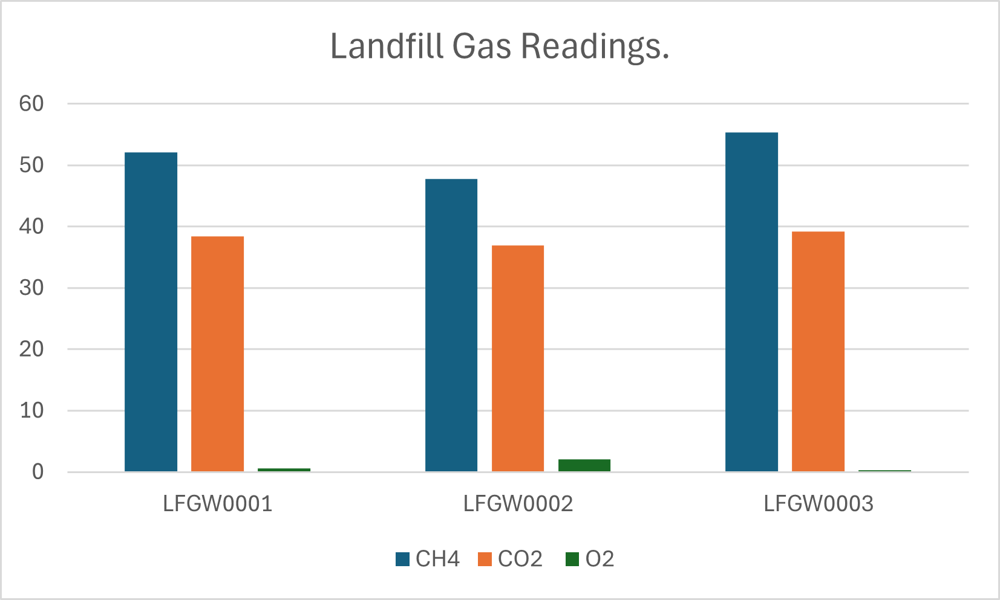
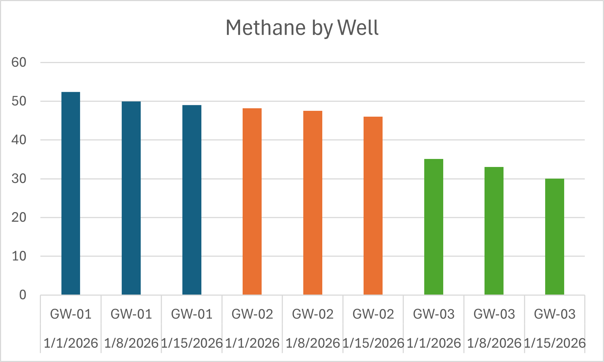
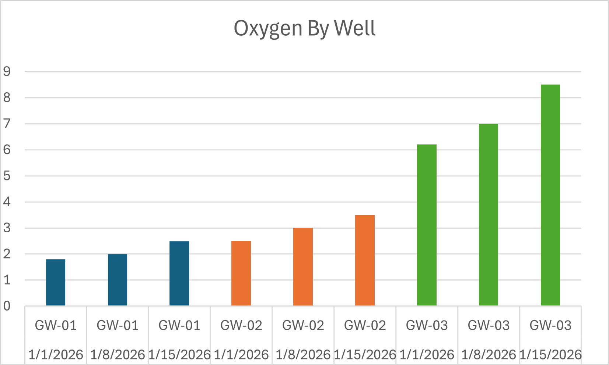

# Landfill Gas Monitoring & Analytics Project

## Executive Summary
This project demonstrates practical landfill gas (LFG) monitoring and analysis by combining field-based knowledge with structured data evaluation. Using simulated wellfield data, the analysis identifies key operational risks such as air intrusion, reduced methane quality, low flow conditions, and condensate impacts.

A Python-based analytics tool is used to generate alert flags, visualize well performance, and support decision-making. A field decision log translates these findings into actionable steps that would be taken during landfill gas system operation and maintenance.

This portfolio reflects the ability to bridge **field operations, environmental monitoring, and data-driven analysis**.

---

## Overview
This project demonstrates applied environmental science skills in landfill gas monitoring, data interpretation, and operational analysis. It integrates real-world landfill gas concepts with structured data analysis to evaluate wellfield performance, identify system issues, and support informed field decision-making.

The portfolio reflects practical experience aligned with landfill gas operations, environmental compliance, and infrastructure monitoring.

---

## Project Components

### 1. Calibration Procedure
- `docs/gem5000_calibration_sop.md`  

Standard operating procedure outlining the calibration process for a GEM5000 landfill gas analyzer.

---

### 2. Sample Datasets
- `data/sample_lfg_readings.csv`  
- `data/sample_lfg_monitoring_data.csv`  

Simulated landfill gas datasets used to demonstrate monitoring, interpretation, and analytical workflows.

---

### 3. Data Interpretation
- `reports/field_interpretation_summary.md`  

Provides detailed interpretation of:
- Methane (CH₄)  
- Carbon dioxide (CO₂)  
- Oxygen (O₂)  
- Balance gas  
- Vacuum pressure and flow conditions  

Focuses on identifying:
- Air intrusion  
- Declining gas quality  
- Inefficient extraction  
- Potential condensate impacts  

---

### 4. Wellfield Analytics Tool
- `src/analyze_wellfield.py`  

Python-based analysis tool that evaluates landfill gas monitoring data and generates:

- Operational alert flags  
- Well health scoring  
- Recommended field actions  

#### Example Conditions Evaluated:
- Oxygen (O₂) > 5% → Potential air intrusion  
- Methane (CH₄) < 40% → Reduced gas quality  
- Low flow → Possible blockage or inactive well  
- Weak vacuum → Reduced extraction efficiency  
- Condensate issues → Maintenance required  

This component demonstrates the ability to translate raw environmental data into actionable insights.

---

### 5. Field Decision Log
- `reports/field_decision_log.md`  

Demonstrates how landfill gas monitoring data is translated into real-world field decisions and operational adjustments.

---

## Data Visualization

This chart illustrates methane concentration trends across selected wells. Higher methane levels generally indicate strong gas production, while lower values may suggest system inefficiencies or potential air intrusion.

---

## Generated Analysis Charts

### Methane Concentration by Well

### Oxygen Concentration by Well

These charts are generated from the Python analysis script and provide a visual evaluation of landfill gas quality, potential air intrusion, and overall wellfield performance.

---

## Priority Wells Requiring Attention

Based on the analysis and field interpretation:

### 1. GW-03 — Air Intrusion & Low Gas Quality
- CH₄ < 40%  
- O₂ > 5%  
- Low flow and weak vacuum  
**Priority Action:** Reduce vacuum, inspect well integrity, and re-balance system  

### 2. GW-02 — Potential Condensate Issue
- Slightly reduced flow  
- Condensate flagged as possible  
**Priority Action:** Inspect sump/pump system and monitor flow trends  

### 3. GW-01 — Stable Operation
- CH₄ > 50%  
- O₂ < 3%  
**Action:** Continue routine monitoring  

This prioritization demonstrates how monitoring data is used to guide field inspections and operational adjustments.

---

## Operational Workflow

This project reflects a typical landfill gas monitoring workflow:

1. Collect field data (CH₄, CO₂, O₂, vacuum, flow)  
2. Evaluate readings for abnormal conditions  
3. Identify potential issues (air intrusion, low gas quality, condensate)  
4. Prioritize wells requiring attention  
5. Apply field adjustments (vacuum tuning, inspections, maintenance)  
6. Re-monitor and confirm system performance  

This workflow demonstrates the connection between **data collection, analysis, and real-world field operations**.

---

## Why This Project Matters
Effective landfill gas management is critical for:
- Maintaining regulatory compliance  
- Reducing greenhouse gas emissions  
- Optimizing gas collection efficiency  
- Protecting infrastructure systems  

This project demonstrates the ability to bridge **field operations and data-driven analysis**, a key skill in environmental consulting, municipal operations, and infrastructure management roles.

---

## Disclaimer
This project uses simulated and generalized data for educational and portfolio purposes only. No confidential or site-specific information is included.
